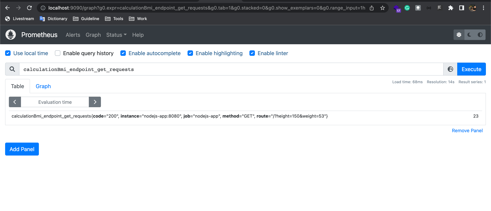

# Monitoring ExpressJs with Prometheus and Grafana
## Prerequisite
- Docker 
- Docker-compose

## Step 
- Jalankan Semua service menggunakan perintah berikut
```bash
    docker-compose up -d
```
- Berikut adalah port untuk masing-masing service
    * localhost:8080 (service node)   
    * localhost:9090 (service prometheuse)   
    * localhost:3000 (service grafana)   

- Untuk mengakses Metrics yang diexpose oleh service (nodejs) menggunakan endpoint berikut *localhost:8080/metrics*
<div align="center">
      
</div>

- Berikut ada metrics yang dibuat kostum bisa dilihat diprometheus:
    * calculationBmi_endpoint_get_requests
    * metrics_endpoint_get_requests
    * http_request_duration_seconds 
<div align="center">
      
      
</div>

- untuk Api nya bisa diakses (local) diendpoint berikut
```
    localhost:8080/?height=150&weight=53
```
<div align="center">
      
      
</div>


- Untuk menambahkan data source prometheus di grafana bisa menggunakan alamat prometheus berikut : http://prometheus:9090


- import dashboard yang dengan nama file dashboard-grafana.json

- Untuk mematikan semua service menggunakan perintah berikut:
```bash
    docker-compose down
```